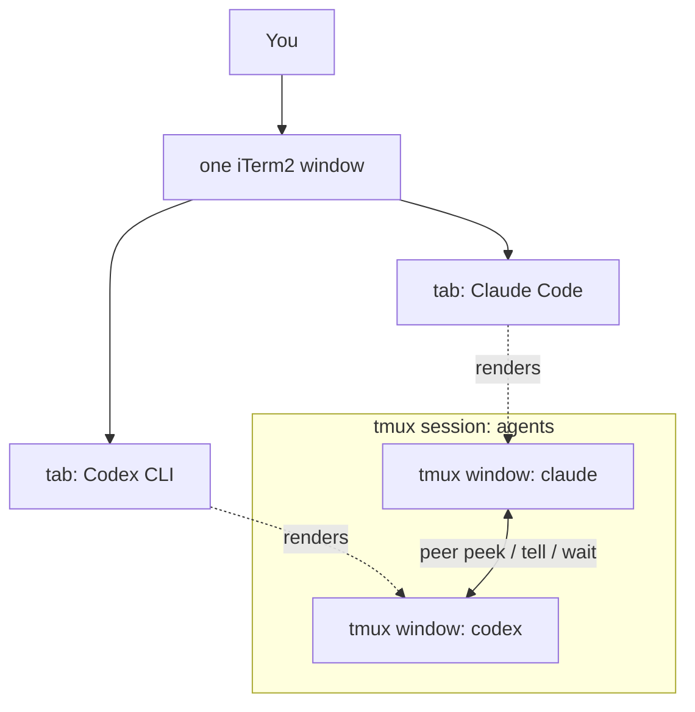
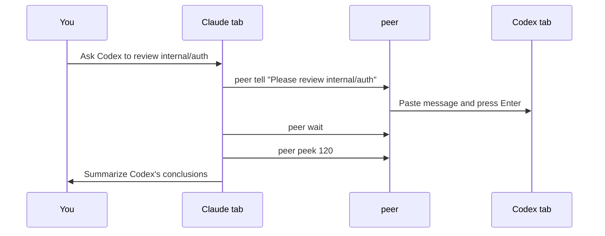

# agent-duo

**Make Claude Code and Codex CLI see each other's screens and talk to each other — inside your normal iTerm2 tabs.**

[简体中文](README.zh-CN.md)

`agent-duo` runs two interactive coding agents (Claude Code and OpenAI Codex CLI) in one tmux session. With iTerm2's native tmux integration (`tmux -CC`), they still look like two ordinary tabs. Each agent gets a tiny `peer` command that lets it:

- **read the other agent's live terminal** (`tmux capture-pane`)
- **type into the other agent's input box** (tmux buffer + bracketed paste)
- **wait** for the other agent to finish its current task

Unlike MCP-based bridges that spawn a *new* headless subprocess (`codex exec` / `claude -p`), `peer` talks to the **actual interactive session you are looking at** — full context preserved, nothing hidden.

## See It At A Glance

Think of `agent-duo` as two real workbenches in one iTerm2 window. Claude and Codex each get
one tab. `tmux` keeps both workbenches alive, and `peer` lets them look at each other or pass a
message only when you ask them to.



A typical delegation looks like this:



## Quick start

```bash
git clone https://github.com/<you>/agent-duo && cd agent-duo
./install.sh                      # symlinks `peer` into ~/.local/bin, checks tmux

cd ~/your-project
agent-duo-start                   # spawns tmux session "agents": window claude + window codex
tmux -CC attach -t agents         # iTerm2 renders the two windows as native tabs
```

If iTerm2 opens the two tmux windows as separate macOS windows, change this iTerm2 setting:
`Settings > General > tmux > When attaching, restore windows as... = Tabs in the attaching window`.
iTerm2 owns that mapping; `agent-duo` creates tmux windows, and iTerm2 decides whether they become native tabs or separate windows.

Append `docs/AGENT-INSTRUCTIONS.md` to your project's `CLAUDE.md` (read by Claude Code) **and** `AGENTS.md` (read by Codex). Same snippet for both — `peer` resolves "self" and "the other side" automatically from `$AGENT_NAME`.

Then just talk naturally:

> *"Ask Codex to review the `internal/auth` package, wait for it to finish, and summarize its conclusions for me."*

Claude will run `peer tell` → `peer wait` → `peer peek` and report back. The reverse direction works the same way from the Codex tab.

## The `peer` command

| Command | What it does |
|---|---|
| `peer peek [lines]` | Show the other agent's recent terminal output (default 80 lines) |
| `peer tell "message"` | Send a one-line message into the other agent's input box and press Enter |
| `... \| peer tell` | Deliver a **multi-line** message from stdin (tmux buffer + bracketed paste — quotes, backticks and newlines arrive verbatim, no escaping) |
| `peer wait [seconds]` | Block until the other agent's screen stops changing (default timeout 300s) |
| `peer esc` | Send Escape to interrupt the other agent's current generation |
| `peer status` | Show identities and window state |

## Why these design choices

- **Buffer + bracketed paste, not `send-keys -l`** — literal send-keys submits on every newline and forces painful quoting. `load-buffer` / `paste-buffer -p` delivers arbitrary multi-line content as a single paste.
- **A real script on PATH, not a shell function in `.zshrc`** — agents execute commands in non-interactive shells that never source your rc files. A function would be invisible to them.
- **0.5s pause between paste and Enter** — TUIs occasionally swallow an Enter that arrives before the paste is processed.
- **Human-in-the-loop by design** — the instruction snippet forbids agents from messaging each other unprompted and from pressing each other's permission prompts. Every exchange originates from you. (This is a prompt-level constraint; keep both agents in non-YOLO permission modes if you want a hard guarantee.)

## Requirements

- macOS / Linux with `tmux` ≥ 3.2 (`brew install tmux`)
- [Claude Code](https://code.claude.com) and [Codex CLI](https://github.com/openai/codex) on PATH
- iTerm2 recommended for the native-tab experience (`tmux -CC`); any terminal works with plain `tmux attach`

## FAQ

**Does this replace MCP bridges like claude-codex-bridge?**
No — they're complementary. MCP bridges give you structured request/response delegation to a fresh subprocess; `agent-duo` gives you visibility into and control of the live sessions you already have open. You can run both.

**Can the two agents loop forever talking to each other?**
The instruction snippet explicitly forbids unsupervised back-and-forth; every round must originate from a user instruction. Token burn stays under your control.

**More than two agents?**
Not yet — see roadmap below.

**Why did iTerm2 open two separate windows instead of tabs?**
iTerm2 maps tmux windows according to `Settings > General > tmux > When attaching, restore windows as...`. Choose `Tabs in the attaching window`, then attach with `tmux -CC attach -t agents`. The other choices are `Native Windows` and `Native tabs in a new window`.

## Roadmap

- [ ] N-agent support (`peer tell <name>`, windows discovered dynamically)
- [ ] `peer ask "..."` — tell + wait + peek in one call, returning only the new output delta
- [ ] Linux clipboard helpers and Windows/WSL notes
- [ ] Demo GIF

## License

MIT
