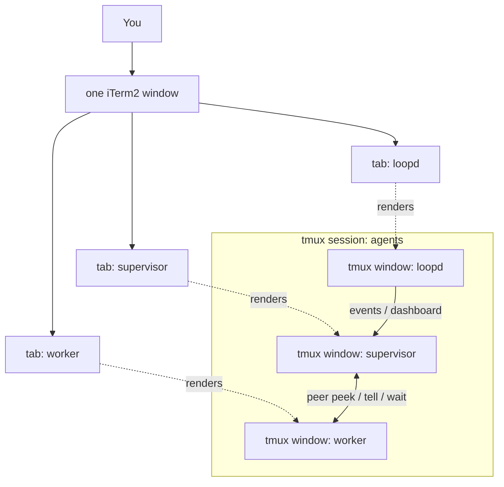
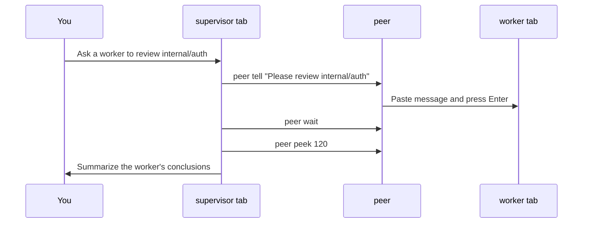

# agent-duo

**Run visible Claude Code / Codex CLI sessions as a supervised coding workbench inside normal iTerm2 tabs.**

[简体中文](README.zh-CN.md)

You say one sentence; the supervisor can add or address a worker, wait, and report back — and the exchange happens live in ordinary tabs, right before your eyes:

```
┌─ iTerm2 ───────────────────────────────────────────┐
│ [ supervisor ]      [ worker ]       [ loopd ]      │
│ ┌────────────────┐  ┌─────────────┐  ┌───────────┐ │
│ │ > Ask Codex to │  │             │  │ queue: 0  │ │
│ │   review auth  │  │             │  │ live      │ │
│ │ $ peer tell ───┼──┼─> Review    │  │           │ │
│ │ $ peer wait    │  │ * Reviewing │  │           │ │
│ │ $ peer peek <──┼──┼─ Found 2    │  │           │ │
│ └────────────────┘  └─────────────┘  └───────────┘ │
└────────────────────────────────────────────────────┘
```

- 👀 **They see each other** — `peer peek` reads the other agent's live terminal
- ⌨️ **They talk to each other** — `peer tell` types into the other agent's input box; `peer wait` waits for it to finish
- 🧑‍⚖️ **You stay in charge** — every exchange starts from your instruction; no unsupervised agent-to-agent chatter

Unlike MCP-based bridges that spawn a *new* headless subprocess (`codex exec` / `claude -p`), `peer` talks to the **actual interactive session you are looking at** — full context preserved, nothing hidden. agent-duo safety hooks are scoped to registered interactive worker panes; do not assume a headless `codex exec` subprocess is protected by the Approval Broker.

## How it works

One tmux session starts with a supervisor tab and a visible `loopd` dashboard. Add workers with `peer add` or start one immediately with `agent-duo-start --with codex:worker`. iTerm2's native tmux integration (`tmux -CC`) renders tmux windows as ordinary tabs, and `peer` gives each agent eyes and a keyboard for the others:



A typical delegation looks like this:



## Quick start

### Install with Homebrew (recommended)

```sh
brew install fovecifer/agent-duo/agent-duo
```

This installs the `peer` and `agent-duo-start` commands and pulls in `tmux` and `jq`.
You still need to install and log in to Claude Code and Codex CLI separately.

### Install from source

```bash
git clone https://github.com/<you>/agent-duo && cd agent-duo
./install.sh                      # symlinks commands into ~/.local/bin, checks tmux/jq

cd ~/your-project
agent-duo-start --with codex:worker
tmux -CC attach -t agents         # iTerm2 renders tmux windows as native tabs
```

If iTerm2 opens tmux windows as separate macOS windows, change this iTerm2 setting:
`Settings > General > tmux > When attaching, restore windows as... = Tabs in the attaching window`.
iTerm2 owns that mapping; `agent-duo` creates tmux windows, and iTerm2 decides whether they become native tabs or separate windows.

On first run in a project, `agent-duo-start` asks once before wiring the agents up:

- **Claude** gets the peer instructions via `--append-system-prompt` at launch — **no file is touched**, and it's gone when the session ends.
- **Codex** has no equivalent launch flag, so the instructions go into a marked, reversible block in your project's `AGENTS.md` (`<!-- agent-duo:start -->` … `<!-- agent-duo:end -->`). `CLAUDE.md` is never modified.

Answer `y` once and it won't ask again (the marker block records your consent); later runs just print a one-line reminder. Decline and it launches without injecting, printing the manual steps.

- Non-interactive shells (CI, pipes) skip injection by default — pass `-y` or set `AGENT_DUO_AUTO_INJECT=1` to inject without the prompt.
- Prefer to wire it up by hand? Append the body of `docs/AGENT-INSTRUCTIONS.md` to your project's `CLAUDE.md` and `AGENTS.md` yourself. Same snippet for both — `peer` resolves identity from the tmux pane `@agent_id` marker, with `AGENT_NAME` kept only as a migration fallback.

`agent-duo-start` without `--with` creates only the supervisor and loopd; run `peer add --provider codex --role worker` from the supervisor when you want a worker later.

Then just talk naturally:

> *"Ask a Codex worker to review the `internal/auth` package, wait for it to finish, and summarize its conclusions for me."*

The supervisor will run `peer tell` → `peer wait` → `peer peek` and report back. Direct agent-to-agent delegation still stays visible in the worker tabs.

A freshly created worker's Approval Broker starts **unverified** (the hook isn't trusted until the provider actually invokes it), and `peer tell` to a worker is fail-closed against that gate. So the first delegation to a new worker is `peer broker-check <id>` → wait for `ready`, *then* `peer tell`. `agent-duo-start --with` and `peer add` both print this reminder.

## The `peer` command

| Command | What it does |
|---|---|
| `peer peek [lines]` | Show the other agent's recent terminal output (default 80 lines) |
| `peer tell "message"` | Send a one-line message into the other agent's input box and press Enter |
| `... \| peer tell` | Deliver a **multi-line** message from stdin (tmux buffer + bracketed paste — quotes, backticks and newlines arrive verbatim, no escaping) |
| `peer wait [seconds] [interval] [stable-samples]` | Block until the other agent's screen is unchanged for repeated samples (defaults: timeout 300s, interval 5s, stable samples 2) |
| `peer task init <id> --task ... --step s1:...` / `peer task next <id>` | Create and inspect a durable `task.json` step ledger for idempotent resume |
| `peer report --type request --status blocked --needs decision ...` | Worker writes a structured report and opens a Human Decision Gate when it needs a human choice |
| `peer gate` / `peer gate open ...` / `peer gate resolve --choice ...` | List, create, and resolve Human Decision Gates; resolutions are written to `decisions.jsonl` and sent back as `decision` verbs |
| `peer approvals` / `peer approve` / `peer deny` | Review and resolve Approval Broker requests for tool permissions |
| `peer esc` | Send Escape to interrupt the other agent's current generation |
| `peer status` | Show identities and window state |

## Why these design choices

- **Buffer + bracketed paste, not `send-keys -l`** — literal send-keys submits on every newline and forces painful quoting. `load-buffer` / `paste-buffer -p` delivers arbitrary multi-line content as a single paste.
- **A real script on PATH, not a shell function in `.zshrc`** — agents execute commands in non-interactive shells that never source your rc files. A function would be invisible to them.
- **0.5s pause between paste and Enter** — TUIs occasionally swallow an Enter that arrives before the paste is processed.
- **Human-in-the-loop by design** — the instruction snippet forbids agents from messaging each other unprompted and from pressing each other's permission prompts. Every exchange originates from you. (This is a prompt-level constraint; keep both agents in non-YOLO permission modes if you want a hard guarantee.)

## Requirements

- macOS / Linux with `tmux` ≥ 3.2 and `jq` (`brew install tmux jq`)
- [Claude Code](https://code.claude.com) and [Codex CLI](https://github.com/openai/codex) on PATH
- iTerm2 recommended for the native-tab experience (`tmux -CC`); any terminal works with plain `tmux attach`

> **Durability note:** the codec writes report/event files with a pure-bash JSON
> encoder and atomic `rename` (readers never see a torn file). It does **not**
> `fsync` — dropping the former Python runtime dependency also dropped cross-crash
> durability, so a power loss / kernel crash could lose an already-acknowledged
> report. This is an intentional trade-off for a single-machine dev tool.

## FAQ

**Does this replace MCP bridges like claude-codex-bridge?**
No — they're complementary. MCP bridges give you structured request/response delegation to a fresh subprocess; `agent-duo` gives you visibility into and control of the live sessions you already have open. You can run both.

**Can the two agents loop forever talking to each other?**
The instruction snippet explicitly forbids unsupervised back-and-forth; every round must originate from a user instruction. Token burn stays under your control.

**More than two agents?**
Not yet — see roadmap below.

**Why did iTerm2 open two separate windows instead of tabs?**
iTerm2 maps tmux windows according to `Settings > General > tmux > When attaching, restore windows as...`. Choose `Tabs in the attaching window`, then attach with `tmux -CC attach -t agents`. The other choices are `Native Windows` and `Native tabs in a new window`.

## Roadmap

- [ ] N-agent support (`peer tell <name>`, windows discovered dynamically)
- [ ] `peer ask "..."` — tell + wait + peek in one call, returning only the new output delta
- [ ] Linux clipboard helpers and Windows/WSL notes
- [ ] Demo GIF

## License

MIT
