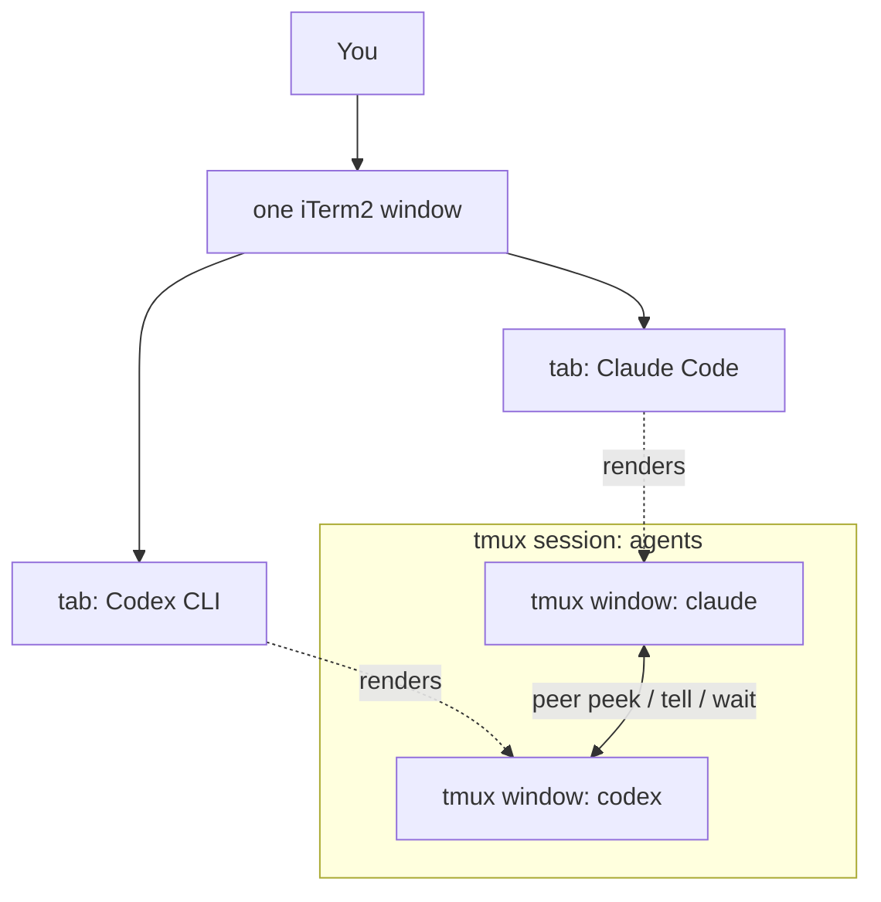
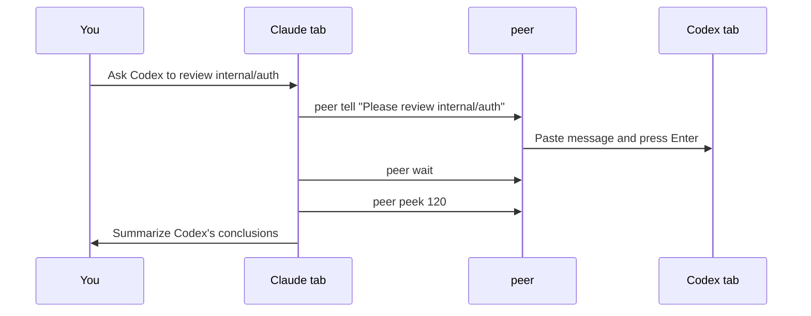

# agent-duo

**Make Claude Code and Codex CLI see each other's screens and talk to each other — inside your normal iTerm2 tabs.**

[简体中文](README.zh-CN.md)

You say one sentence; Claude delegates to Codex, waits, and reports back — and the whole exchange happens live, in two ordinary tabs, right before your eyes:

```
┌─ iTerm2 ───────────────────────────────────────────┐
│  [ Claude Code ]         [ Codex CLI ]             │
│ ┌──────────────────────┐  ┌──────────────────────┐ │
│ │ > Ask Codex to review│  │                      │ │
│ │   internal/auth      │  │                      │ │
│ │                      │  │                      │ │
│ │ $ peer tell "..." ───┼──┼──> Please review     │ │
│ │                      │  │    internal/auth     │ │
│ │ $ peer wait          │  │ * Reviewing...       │ │
│ │ $ peer peek <────────┼──┼── Found 2 issues     │ │
│ └──────────────────────┘  └──────────────────────┘ │
└────────────────────────────────────────────────────┘
```

- 👀 **They see each other** — `peer peek` reads the other agent's live terminal
- ⌨️ **They talk to each other** — `peer tell` types into the other agent's input box; `peer wait` waits for it to finish
- 🧑‍⚖️ **You stay in charge** — every exchange starts from your instruction; no unsupervised agent-to-agent chatter

Unlike MCP-based bridges that spawn a *new* headless subprocess (`codex exec` / `claude -p`), `peer` talks to the **actual interactive session you are looking at** — full context preserved, nothing hidden.

## How it works

One tmux session, two windows — `claude` and `codex`. iTerm2's native tmux integration (`tmux -CC`) renders them as two ordinary tabs, and the tiny `peer` command gives each agent eyes and a keyboard for the other side:



A typical delegation looks like this:



## Quick start

```bash
git clone https://github.com/<you>/agent-duo && cd agent-duo
./install.sh                      # symlinks `peer` into ~/.local/bin, checks tmux

cd ~/your-project
agent-duo-start                   # spawns tmux session "agents": window claude + window codex
tmux -CC attach -t agents         # iTerm2 renders the two windows as native tabs
```

If iTerm2 opens the two tmux windows as separate macOS windows, change this iTerm2 setting:
`Settings > General > tmux > When attaching, restore windows as... = Tabs in the attaching window`.
iTerm2 owns that mapping; `agent-duo` creates tmux windows, and iTerm2 decides whether they become native tabs or separate windows.

On first run in a project, `agent-duo-start` asks once before wiring the agents up:

- **Claude** gets the peer instructions via `--append-system-prompt` at launch — **no file is touched**, and it's gone when the session ends.
- **Codex** has no equivalent launch flag, so the instructions go into a marked, reversible block in your project's `AGENTS.md` (`<!-- agent-duo:start -->` … `<!-- agent-duo:end -->`). `CLAUDE.md` is never modified.

Answer `y` once and it won't ask again (the marker block records your consent); later runs just print a one-line reminder. Decline and it launches without injecting, printing the manual steps.

- Non-interactive shells (CI, pipes) skip injection by default — pass `-y` or set `AGENT_DUO_AUTO_INJECT=1` to inject without the prompt.
- Prefer to wire it up by hand? Append the body of `docs/AGENT-INSTRUCTIONS.md` to your project's `CLAUDE.md` and `AGENTS.md` yourself. Same snippet for both — `peer` resolves "self" and "the other side" automatically from `$AGENT_NAME`.

Then just talk naturally:

> *"Ask Codex to review the `internal/auth` package, wait for it to finish, and summarize its conclusions for me."*

Claude will run `peer tell` → `peer wait` → `peer peek` and report back. The reverse direction works the same way from the Codex tab.

## The `peer` command

| Command | What it does |
|---|---|
| `peer peek [lines]` | Show the other agent's recent terminal output (default 80 lines) |
| `peer tell "message"` | Send a one-line message into the other agent's input box and press Enter |
| `... \| peer tell` | Deliver a **multi-line** message from stdin (tmux buffer + bracketed paste — quotes, backticks and newlines arrive verbatim, no escaping) |
| `peer wait [seconds]` | Block until the other agent's screen stops changing (default timeout 300s) |
| `peer esc` | Send Escape to interrupt the other agent's current generation |
| `peer status` | Show identities and window state |

## Why these design choices

- **Buffer + bracketed paste, not `send-keys -l`** — literal send-keys submits on every newline and forces painful quoting. `load-buffer` / `paste-buffer -p` delivers arbitrary multi-line content as a single paste.
- **A real script on PATH, not a shell function in `.zshrc`** — agents execute commands in non-interactive shells that never source your rc files. A function would be invisible to them.
- **0.5s pause between paste and Enter** — TUIs occasionally swallow an Enter that arrives before the paste is processed.
- **Human-in-the-loop by design** — the instruction snippet forbids agents from messaging each other unprompted and from pressing each other's permission prompts. Every exchange originates from you. (This is a prompt-level constraint; keep both agents in non-YOLO permission modes if you want a hard guarantee.)

## Requirements

- macOS / Linux with `tmux` ≥ 3.2 (`brew install tmux`)
- [Claude Code](https://code.claude.com) and [Codex CLI](https://github.com/openai/codex) on PATH
- iTerm2 recommended for the native-tab experience (`tmux -CC`); any terminal works with plain `tmux attach`

## FAQ

**Does this replace MCP bridges like claude-codex-bridge?**
No — they're complementary. MCP bridges give you structured request/response delegation to a fresh subprocess; `agent-duo` gives you visibility into and control of the live sessions you already have open. You can run both.

**Can the two agents loop forever talking to each other?**
The instruction snippet explicitly forbids unsupervised back-and-forth; every round must originate from a user instruction. Token burn stays under your control.

**More than two agents?**
Not yet — see roadmap below.

**Why did iTerm2 open two separate windows instead of tabs?**
iTerm2 maps tmux windows according to `Settings > General > tmux > When attaching, restore windows as...`. Choose `Tabs in the attaching window`, then attach with `tmux -CC attach -t agents`. The other choices are `Native Windows` and `Native tabs in a new window`.

## Roadmap

- [ ] N-agent support (`peer tell <name>`, windows discovered dynamically)
- [ ] `peer ask "..."` — tell + wait + peek in one call, returning only the new output delta
- [ ] Linux clipboard helpers and Windows/WSL notes
- [ ] Demo GIF

## License

MIT
