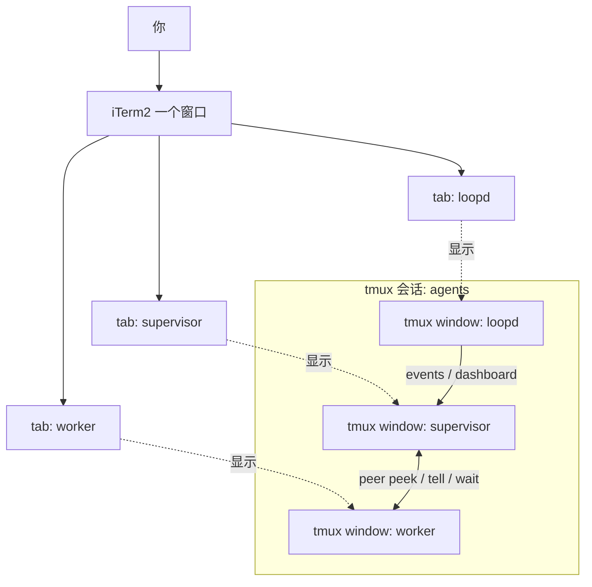
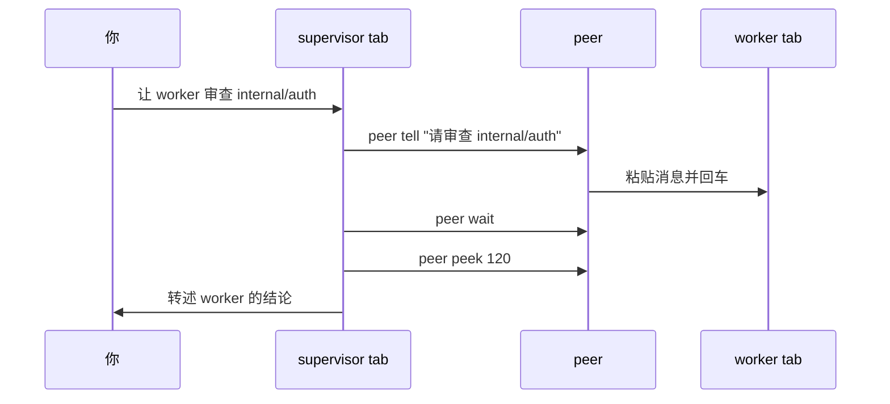

# agent-duo

**把可见的 Claude Code / Codex CLI 会话组织成一个 supervisor 工作台 —— 就在普通 iTerm2 tab 里。**

你说一句话，supervisor 可以按需创建 worker、等待结果、再向你汇报 —— 整个过程都在你眼前的普通 tab 里发生：

```
┌─ iTerm2 ───────────────────────────────────────────┐
│ [ supervisor ]      [ worker ]       [ loopd ]      │
│ ┌────────────────┐  ┌─────────────┐  ┌───────────┐ │
│ │ > 让 Codex 审查│  │             │  │ queue: 0  │ │
│ │   internal/auth│  │             │  │ live      │ │
│ │ $ peer tell ───┼──┼─> 请审查    │  │           │ │
│ │ $ peer wait    │  │ * 审查中... │  │           │ │
│ │ $ peer peek <──┼──┼─ 发现 2 问题│  │           │ │
│ └────────────────┘  └─────────────┘  └───────────┘ │
└────────────────────────────────────────────────────┘
```

- 👀 **互相看屏** — `peer peek` 读取对方的实时终端
- ⌨️ **互相传话** — `peer tell` 直接打进对方输入框，`peer wait` 等对方干完
- 🧑‍⚖️ **你说了算** — 每次交互都由你发起，不允许两个 agent 私下循环对话

不同于另起 headless 子进程的 MCP 桥接方案（`codex exec` / `claude -p`），`peer` 对接的是你眼前那个**真实的交互会话** —— 上下文完整保留，没有黑盒。

## 工作原理

一个 tmux 会话会先启动 supervisor tab 和可见的 `loopd` 看板。worker 可以用 `peer add` 按需创建，也可以用 `agent-duo-start --with codex:worker` 启动时直接带一个。iTerm2 的 tmux 原生集成（`tmux -CC`）把 tmux window 渲染成普通 tab，`peer` 命令则给每个 agent 一双"看对方屏幕"的眼睛和一只"往对方输入框打字"的手：



一次典型协作看起来是这样:



如果要给别人演示,可以照着 [中文演示脚本](docs/DEMO.zh-CN.md) 走一遍。

## 文件

```
agent-duo/
├── start.sh                 # 一键启动 supervisor + loopd,可选再起 worker
├── bin/peer                 # 互看/互发指令的核心命令
└── docs/AGENT-INSTRUCTIONS.md
                              # 追加到 CLAUDE.md / AGENTS.md 的协作说明
```

## 安装(一次性)

### 用 Homebrew 安装（推荐）

```sh
brew install fovecifer/agent-duo/agent-duo
```

会安装 `peer` 与 `agent-duo-start` 命令，并自动装上 `tmux` 与 `jq`。
Claude Code 与 Codex CLI 仍需你自行安装并登录。

### 从源码安装

1. `brew install tmux jq`(如已安装可跳过)
2. 获取本仓库并安装命令:

   ```bash
   git clone https://github.com/<you>/agent-duo && cd agent-duo
   ./install.sh
   ```

3. `agent-duo-start` 在某个项目里**首次运行**时会询问一次,再启动 supervisor 与 loopd：

   - **Claude**：通过启动参数 `--append-system-prompt` 传入协作说明 —— **不写任何文件**,会话结束即消失。
   - **Codex**：没有等价的启动参数,因此说明会以带标记、可撤销的块写入项目的 `AGENTS.md`（`<!-- agent-duo:start -->` … `<!-- agent-duo:end -->`）。`CLAUDE.md` 不会被改动。

   回答 `y` 后不会再询问(标记块本身就是同意的记录);后续运行只打印一行友好提示。拒绝则直接启动,不注入,并打印手动步骤。

   - 非交互环境(CI、管道)默认跳过注入 —— 加 `-y` 或设 `AGENT_DUO_AUTO_INJECT=1` 可无提示自动注入。
   - 更喜欢手动操作?把 `docs/AGENT-INSTRUCTIONS.md` 的正文追加到项目的 `CLAUDE.md` 和 `AGENTS.md` 即可。两个文件用同一段内容,`peer` 会从 tmux pane 的 `@agent_id` 标记识别身份;`AGENT_NAME` 只保留作迁移回退。

> **耐久性说明:** codec 用纯 Bash 的 JSON 编码器加原子 `rename` 写 report/event
> 文件(读者永远不会读到半截文件),但**不再 `fsync`** —— 去掉 Python 运行时依赖的同时
> 也放弃了跨崩溃耐久性:断电 / 内核崩溃可能丢失一条已返回成功的 report。对单机开发
> 工具而言这是有意的取舍,原子性与正常读写不受影响。

## 日常使用

```bash
cd ~/your-project
agent-duo-start --with codex:worker
tmux -CC attach -t agents     # 在 iTerm2 中附加;tmux window → 原生 tab
```

如果 iTerm2 把 tmux window 打开成独立的 macOS 窗口,把这个设置改成 tab:
`Settings > General > tmux > When attaching, restore windows as... = Tabs in the attaching window`。
这一步由 iTerm2 决定;`agent-duo` 只负责创建 tmux window。

不带 `--with` 时只创建 supervisor 和 loopd;之后可在 supervisor 里运行
`peer add --provider codex --role worker` 按需创建 worker。

之后正常在各个 tab 里分别和 Claude Code、Codex 对话。需要它们交互时,
直接用自然语言指挥,例如:

- 对 Claude 说:「看一下 Codex 现在在干什么」 → 它会执行 `peer peek` 并转述
- 对 Claude 说:「让 Codex 审查一下 internal/auth 这个包,等它写完后把结论总结给我」
  → 它会 `peer tell` → `peer wait` → `peer peek`,再向你汇报
- 对 Codex 说:「问问 Claude 它对这个方案的意见」 → 反方向同理

新建 worker 的 Approval Broker 起始为 **unverified**(hook 未被 provider 实际调用前不可信),
而 `peer tell` 发给 worker 是对这道门 fail-closed 的。所以对一个新 worker 的第一次派发是
`peer broker-check <id>` → 等到 `ready`,**再** `peer tell`。`agent-duo-start --with` 和
`peer add` 都会打印这条提醒。

结束:`tmux kill-session -t agents`

## peer 命令参考

| 命令 | 作用 |
|---|---|
| `peer peek [行数]` | 查看对方终端最近输出(默认 80 行) |
| `peer tell "消息"` | 发送单行消息并回车 |
| `... \| peer tell` | 从 stdin 投递多行消息(buffer + bracketed paste,引号/换行安全) |
| `peer wait [秒] [采样间隔] [连续稳定次数]` | 等待对方输出连续多次采样一致(默认最长 300s、间隔 5s、连续 2 次) |
| `peer report --type request --status blocked --needs decision ...` | worker 写结构化报告；需要人类选择时自动打开 Human Decision Gate |
| `peer gate` / `peer gate open ...` / `peer gate resolve --choice ...` | 查看、创建、解决 Human Decision Gate；选择会写入 `decisions.jsonl` 并以 `decision` 动词发回 worker |
| `peer approvals` / `peer approve` / `peer deny` | 查看并处理 Approval Broker 的工具权限请求 |
| `peer esc` | 向对方发 Escape,打断其生成 |
| `peer status` | 查看双方身份与窗口状态 |

身份由 tmux pane 上的 `@agent_id` 标记决定;正好两个 agent 时 `peer` 可自动把
"对方"解析为另一个窗口,三人及以上必须显式指定 id。

## 原理与注意事项

- **tell 的投递机制**:`tmux load-buffer` + `paste-buffer -p`(bracketed paste),
  TUI 会把内容识别为一次完整粘贴,多行不会被逐行提交,引号反引号无需转义;
  粘贴后 sleep 0.5 再回车,避免 TUI 还没处理完粘贴就把回车吞掉。
- **为什么 peer 是独立脚本而不是 ~/.zshrc 里的函数**:Claude Code / Codex 执行命令
  用的是非交互式 shell,不会 source .zshrc,shell 函数对它们不可见;
  PATH 上的可执行脚本才能被两个 agent 直接调用。
- **peek 输出含 TUI 噪音**(边框、状态栏、spinner),说明文件里已提示 agent 自行过滤。
- **安全**:`peer tell` 等同于在对方终端打字,意味着一个 agent 理论上可以替另一个
  agent 按下权限确认键。说明文件中已明确禁止这样做(由用户决定),但这只是提示词层面的
  约束;如果你担心,可让两个 agent 都跑在各自的非 YOLO 权限模式下,确认弹窗仍需你本人处理。
- **不要让它们无人监督地互相循环对话**:说明文件规定每轮交互都必须源自你的指令,
  避免两个 agent 互相触发、token 烧穿。
- 如果你后来想要"结构化的互相调用"(而不是看屏幕),可以叠加 MCP 方案:
  `npx claude-codex-bridge setup` 双向安装即可,与本方案不冲突。

## 故障排查

- `peer: command not found` → agent 的 shell 没继承 PATH;确认是通过 `start.sh`
  启动的,或在 agent 里用绝对路径调用。
- `会话不存在` → 先运行 `start.sh`;自定义会话名时需同时设置 `AGENT_SESSION`。
- iTerm2 附加后没有变成原生 tab → 必须用 `tmux -CC attach`(注意 `-CC`),
  且在 iTerm2 → Settings → General → tmux 中把
  `When attaching, restore windows as...` 设为 `Tabs in the attaching window`。
  另外两个选项是 `Native Windows` 和 `Native tabs in a new window`。
