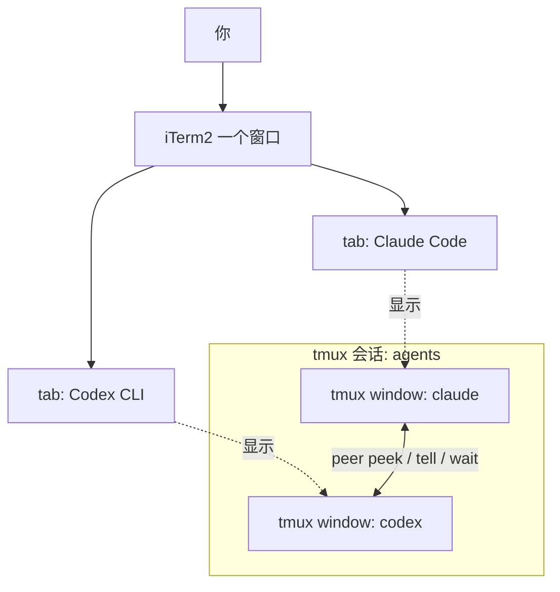
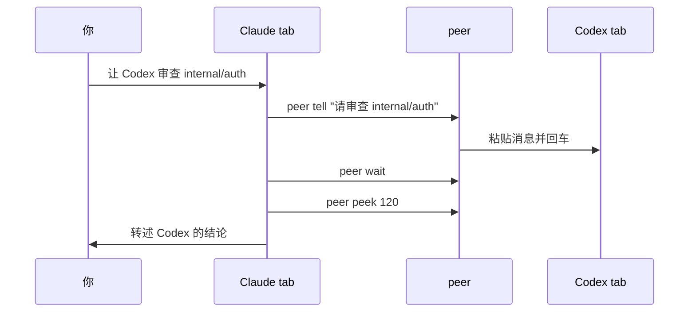

# agent-duo

**让 Claude Code 和 Codex 互相看屏、互相传话 —— 就在你眼前的两个普通 iTerm2 tab 里。**

对 Claude 说一句话，它就会指挥 Codex 干活、等结果、再向你汇报 —— 整个过程在两个 tab 里全程肉眼可见：

```
┌─ iTerm2 ───────────────────────────────────────────┐
│  [ Claude Code ]         [ Codex CLI ]             │
│ ┌──────────────────────┐  ┌──────────────────────┐ │
│ │ > 让 Codex 审查      │  │                      │ │
│ │   internal/auth      │  │                      │ │
│ │                      │  │                      │ │
│ │ $ peer tell "..." ───┼──┼──> 请审查 internal/  │ │
│ │                      │  │    auth              │ │
│ │ $ peer wait          │  │ * 审查中...          │ │
│ │ $ peer peek <────────┼──┼── 发现 2 个问题      │ │
│ └──────────────────────┘  └──────────────────────┘ │
└────────────────────────────────────────────────────┘
```

- 👀 **互相看屏** — `peer peek` 读取对方的实时终端
- ⌨️ **互相传话** — `peer tell` 直接打进对方输入框，`peer wait` 等对方干完
- 🧑‍⚖️ **你说了算** — 每次交互都由你发起，不允许两个 agent 私下循环对话

不同于另起 headless 子进程的 MCP 桥接方案（`codex exec` / `claude -p`），`peer` 对接的是你眼前那个**真实的交互会话** —— 上下文完整保留，没有黑盒。

## 工作原理

一个 tmux 会话、两个窗口（claude / codex）。iTerm2 的 tmux 原生集成（`tmux -CC`）把它们渲染成两个普通 tab，`peer` 命令则给每个 agent 一双"看对方屏幕"的眼睛和一只"往对方输入框打字"的手：



一次典型协作看起来是这样:



如果要给别人演示,可以照着 [中文演示脚本](docs/DEMO.zh-CN.md) 走一遍。

## 文件

```
agent-duo/
├── start.sh                 # 一键启动两个 agent
├── bin/peer                 # 互看/互发指令的核心命令
└── docs/AGENT-INSTRUCTIONS.md
                              # 追加到 CLAUDE.md / AGENTS.md 的协作说明
```

## 安装(一次性)

### 用 Homebrew 安装（推荐）

```sh
brew install fovecifer/agent-duo/agent-duo
```

会安装 `peer` 与 `agent-duo-start` 命令，并自动装上 `tmux` 与 `python3`。
`python3` 用于 codec 的 JSON 写入与 fsync 耐久性。
Claude Code 与 Codex CLI 仍需你自行安装并登录。

### 从源码安装

1. `brew install tmux`(如已安装可跳过)
2. `brew install python`(如已有 `python3` 可跳过)
3. 获取本仓库并安装命令:

   ```bash
   git clone https://github.com/<you>/agent-duo && cd agent-duo
   ./install.sh
   ```

4. `agent-duo-start` 在某个项目里**首次运行**时会询问一次,再启动两个 agent：

   - **Claude**：通过启动参数 `--append-system-prompt` 传入协作说明 —— **不写任何文件**,会话结束即消失。
   - **Codex**：没有等价的启动参数,因此说明会以带标记、可撤销的块写入项目的 `AGENTS.md`（`<!-- agent-duo:start -->` … `<!-- agent-duo:end -->`）。`CLAUDE.md` 不会被改动。

   回答 `y` 后不会再询问(标记块本身就是同意的记录);后续运行只打印一行友好提示。拒绝则直接启动,不注入,并打印手动步骤。

   - 非交互环境(CI、管道)默认跳过注入 —— 加 `-y` 或设 `AGENT_DUO_AUTO_INJECT=1` 可无提示自动注入。
   - 更喜欢手动操作?把 `docs/AGENT-INSTRUCTIONS.md` 的正文追加到项目的 `CLAUDE.md` 和 `AGENTS.md` 即可。两个文件用同一段内容,`peer` 会从 `$AGENT_NAME` 自动识别"自己"和"对方"。

## 日常使用

```bash
cd ~/your-project
agent-duo-start               # 创建会话,两个窗口分别启动 claude 和 codex
tmux -CC attach -t agents     # 在 iTerm2 中附加;两个窗口 → 两个原生 tab
```

如果 iTerm2 把它们打开成两个独立的 macOS 窗口,把这个设置改成 tab:
`Settings > General > tmux > When attaching, restore windows as... = Tabs in the attaching window`。
这一步由 iTerm2 决定;`agent-duo` 只负责创建两个 tmux window。

之后正常在两个 tab 里分别和 Claude Code、Codex 对话。需要它们交互时,
直接用自然语言指挥,例如:

- 对 Claude 说:「看一下 Codex 现在在干什么」 → 它会执行 `peer peek` 并转述
- 对 Claude 说:「让 Codex 审查一下 internal/auth 这个包,等它写完后把结论总结给我」
  → 它会 `peer tell` → `peer wait` → `peer peek`,再向你汇报
- 对 Codex 说:「问问 Claude 它对这个方案的意见」 → 反方向同理

结束:`tmux kill-session -t agents`

## peer 命令参考

| 命令 | 作用 |
|---|---|
| `peer peek [行数]` | 查看对方终端最近输出(默认 80 行) |
| `peer tell "消息"` | 发送单行消息并回车 |
| `... \| peer tell` | 从 stdin 投递多行消息(buffer + bracketed paste,引号/换行安全) |
| `peer wait [秒] [采样间隔] [连续稳定次数]` | 等待对方输出连续多次采样一致(默认最长 300s、间隔 5s、连续 2 次) |
| `peer esc` | 向对方发 Escape,打断其生成 |
| `peer status` | 查看双方身份与窗口状态 |

身份由 `start.sh` 注入的 `AGENT_NAME` 环境变量决定,`peer` 自动把"对方"
解析为另一个窗口,两个 agent 用的是同一个脚本。

## 原理与注意事项

- **tell 的投递机制**:`tmux load-buffer` + `paste-buffer -p`(bracketed paste),
  TUI 会把内容识别为一次完整粘贴,多行不会被逐行提交,引号反引号无需转义;
  粘贴后 sleep 0.5 再回车,避免 TUI 还没处理完粘贴就把回车吞掉。
- **为什么 peer 是独立脚本而不是 ~/.zshrc 里的函数**:Claude Code / Codex 执行命令
  用的是非交互式 shell,不会 source .zshrc,shell 函数对它们不可见;
  PATH 上的可执行脚本才能被两个 agent 直接调用。
- **peek 输出含 TUI 噪音**(边框、状态栏、spinner),说明文件里已提示 agent 自行过滤。
- **安全**:`peer tell` 等同于在对方终端打字,意味着一个 agent 理论上可以替另一个
  agent 按下权限确认键。说明文件中已明确禁止这样做(由用户决定),但这只是提示词层面的
  约束;如果你担心,可让两个 agent 都跑在各自的非 YOLO 权限模式下,确认弹窗仍需你本人处理。
- **不要让它们无人监督地互相循环对话**:说明文件规定每轮交互都必须源自你的指令,
  避免两个 agent 互相触发、token 烧穿。
- 如果你后来想要"结构化的互相调用"(而不是看屏幕),可以叠加 MCP 方案:
  `npx claude-codex-bridge setup` 双向安装即可,与本方案不冲突。

## 故障排查

- `peer: command not found` → agent 的 shell 没继承 PATH;确认是通过 `start.sh`
  启动的,或在 agent 里用绝对路径调用。
- `会话不存在` → 先运行 `start.sh`;自定义会话名时需同时设置 `AGENT_SESSION`。
- iTerm2 附加后没有变成原生 tab → 必须用 `tmux -CC attach`(注意 `-CC`),
  且在 iTerm2 → Settings → General → tmux 中把
  `When attaching, restore windows as...` 设为 `Tabs in the attaching window`。
  另外两个选项是 `Native Windows` 和 `Native tabs in a new window`。
