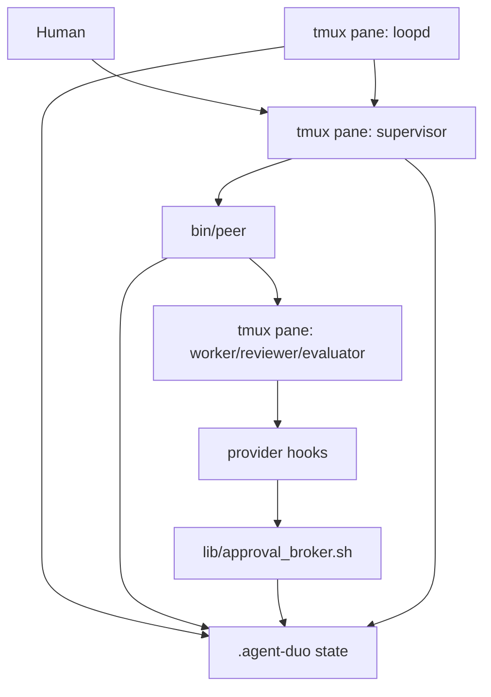

# agent-duo 实现细节

本文面向维护者和希望改造 `agent-duo` 的开发者。内容以当前代码为准，覆盖启动、tmux registry、transport、loop runtime、Approval Broker、状态文件、测试与扩展边界。

## 1. 代码地图

```text
agent-duo/
  start.sh                         # 创建 tmux session、supervisor、loopd、可选 worker
  bin/
    peer                           # 用户命令入口，包含 transport/building-blocks/steering
    agent-duo-approval-hook        # provider hook 入口，委托 approval_broker.sh
  lib/
    registry.sh                    # agent id/role/provider/worktree helper
    loop.sh                        # loopd 和 supervisor hooks 共用的 runtime helper
    approval_broker.sh             # Codex/Claude hook policy、approval 存储、状态 marker
    inject.sh                      # AGENTS.md 注入 helper
  scripts/
    loopd                          # 可见 daemon，看板 + runtime poller + verify runner
    supervisor-stop-drain-hook     # supervisor Stop hook，投递事件并执行合门硬门
    supervisor-user-prompt-submit-hook # supervisor UserPromptSubmit hook，标记 busy
  docs/
    AGENT-INSTRUCTIONS.md          # 注入给 agent 的协作协议
    mission-template.md            # NL mission 三段模板
    SUPERVISOR-LOOP-PLAYBOOK.md    # supervisor 相位编排 playbook
    roles/                         # planner/builder/reviewer/evaluator 角色定义
    glossary.md                    # 术语
    superpowers/specs/             # 设计规格
  test/
    unit/ cli/ integration/ e2e/    # 分层 Bash 测试
    lib/assert.sh                  # 测试断言 helper
    lib/harness.sh                 # 共享测试 harness 和 tmux stub
```

项目是 Bash 3.2 兼容实现，主要依赖：

- `tmux`
- `jq`
- `git`
- `shasum` 或 `sha256sum`
- Claude Code / Codex CLI

## 2. 总体架构



关键点：

- tmux 是在线 agent registry 的事实来源。
- `.agent-duo/` 是 loop 状态、事件、审计的事实来源。
- `peer` 是唯一命令入口。普通用户推荐给 supervisor 一份自然语言 mission；`peer` 退为 supervisor 按 playbook 调用的内部控制面，同时仍可用于调试和手动恢复。
- `loopd` 是可见 runtime，而不是隐藏 daemon。
- provider hook 把工具权限接入 `.agent-duo/approvals` 和 `.agent-duo/events`。

## 3. 启动流程

入口是 [start.sh](../start.sh)。

### 3.1 参数解析

支持：

```bash
agent-duo-start [工作目录]
agent-duo-start --supervisor claude|codex
agent-duo-start --with <provider>:<role>
agent-duo-start --with <provider>:<role>:isolated
agent-duo-start -y
```

`--with ...:isolated` 会调用 `reg_create_worktree` 创建 git worktree。

### 3.2 前置检查

`start.sh` 会检查：

- `tmux` 是否存在。
- `jq` 是否存在。
- `claude` 和 `codex` 是否在 PATH 中。
- `lib/inject.sh`、`lib/registry.sh`、Approval Broker 组件是否存在。
- 目标 tmux session 是否已经存在。

### 3.3 协作指令注入

注入策略来自 `lib/inject.sh`：

- Claude supervisor：通过 `--append-system-prompt "$(cat docs/AGENT-INSTRUCTIONS.md)"`。
- Codex：写入项目 `AGENTS.md` 的 `agent-duo:start` / `agent-duo:end` 标记块。

Codex 没有与 Claude `--append-system-prompt` 等价的启动参数，所以需要项目文件注入。

### 3.4 supervisor pane

`start.sh` 创建 tmux session：

```bash
tmux new-session -d -s "$SESSION" -n supervisor -c "$WORKDIR" -P -F '#{pane_id}'
```

随后设置 pane option：

```text
@agent_id       supervisor
@agent_role     supervisor
@agent_provider claude|codex
```

Claude supervisor 会加载 `.agent-duo/state/supervisor/session-settings.json`，其中包含：

- `UserPromptSubmit` hook：标记 supervisor busy。
- `Stop` hook：标记 supervisor idle，并尝试投递一个 pending event。

Codex supervisor 通过 `codex -c hooks...` 注入同类 hook。

### 3.5 loopd pane

`start.sh` 创建 `loopd` window：

```text
@agent_id       loopd
@agent_role     daemon
@agent_provider bash
```

并执行：

```bash
peer loopd
```

`peer loopd` 再 exec [scripts/loopd](../scripts/loopd)。

### 3.6 可选 worker

`--with codex:worker` 或 `peer agent add` 的接线基本一致：

1. 创建 pane。
2. 设置 `@agent_id`、`@agent_role`、`@agent_provider`。
3. 生成 Approval Broker session settings。
4. 给 Claude 传 `--settings`，给 Codex 传 `-c hooks.PreToolUse...` 和 `-c hooks.PermissionRequest...`。
5. 设置环境变量：

```text
AGENT_SESSION
AGENT_DUO_ROOT
AGENT_DUO_AGENT_ID
AGENT_DUO_WORKTREE
AGENT_DUO_APPROVAL_HOOK
AGENT_DUO_APPROVAL_SETTINGS
PATH=<agent-duo bin>:$PATH
```

6. 把 broker marker 写为 `unverified`。

## 4. tmux Registry

registry 分成两部分：

- 运行时读取 tmux pane option：`bin/peer` 内的 `list_agents` / `pane_for_id`。
- 纯 helper：`lib/registry.sh`。

### 4.1 在线 agent 列表

`peer agent ls` 调用：

```bash
tmux list-panes -s -t "$SESSION" \
  -F '#{pane_id}\t#{@agent_id}\t#{@agent_role}\t#{@agent_provider}'
```

输出字段：

```text
pane_id<TAB>agent_id<TAB>role<TAB>provider
```

未注册 pane 会显示 `(unregistered)`。

### 4.2 自我身份

`bin/peer` 的 `self_id` 优先读当前 `TMUX_PANE` 的 `@agent_id`，缺失时回退 `AGENT_NAME`。这是迁移兼容路径。

如果既没有 pane option，也没有 `AGENT_NAME`，`peer` 会报错并退出。

### 4.3 目标解析

`resolve_target_pane` 的规则：

- 显式 id：必须存在。
- 省略 id：调用 `reg_pick_other`。
- 正好一个 other：成功。
- 没有 other：报错。
- 多个 other：报错，要求指定目标。

这就是多人会话必须显式寻址的实现来源。

## 5. Worktree 隔离

实现位于 [lib/registry.sh](../lib/registry.sh)。

### 5.1 路径策略

默认 worktree base：

```text
<repo parent>/.agent-duo-worktrees/<repo-name>-<sha8>/<session>/<id>
```

可用环境变量覆盖：

```text
AGENT_DUO_WORKTREES_DIR
```

分支名：

```text
agent-duo/<id>
```

映射记录：

```text
.agent-duo/state/<id>/worktree.json
```

### 5.2 创建

`reg_create_worktree <id> [root] [session]`：

1. 找 git root。
2. 计算 worktree base。
3. 如果目标路径已存在，验证它是否是预期 id/branch 的 git worktree。
4. 如果分支存在，`git worktree add <path> <branch>`。
5. 否则 `git worktree add -b <branch> <path> HEAD`。

### 5.3 删除

`reg_remove_worktree <root> <id> <force>`：

- 无记录返回 2。
- 记录无效时保留并警告。
- worktree 不匹配时保留并警告。
- worktree 脏且非 force 时保留并提示。
- force 时 `git worktree remove --force`。

删除 worker tab 不等于一定删除 worktree，这是刻意的安全策略。

## 6. peer 命令入口

[bin/peer](../bin/peer) 负责所有用户命令。文件顶部的 `static_preflight_dispatch` 在加载运行逻辑前处理：

- `--help`
- 子命令 help
- 旧命令迁移报错
- 移除的 `peer report --verdict` 参数

命令分三层：

```text
Transport:
  peek / tell / wait / esc / status

Loop building-blocks:
  agent / loop / verify / judge / task / report / gate / approval / budget

Steering:
  ask / checkpoint / reframe
```

## 7. Transport 实现

### 7.1 peek

`peer peek`：

1. `ensure_session`。
2. 解析目标。
3. 调用 `capture`：

```bash
tmux capture-pane -p -J -t "$pane" -S "-$lines"
```

`-J` 会 join wrapped lines。

### 7.2 tell

`peer tell`：

1. 解析 `--force`。
2. 如果首参精确匹配已注册 id，则作为目标。
3. `check_target_dispatch_allowed`。
4. 使用 tmux buffer 投递：

```bash
printf '%s' "$text" | tmux load-buffer -b "$buf" -
tmux paste-buffer -b "$buf" -t "$pane" -d -p
sleep 0.5
tmux send-keys -t "$pane" Enter
```

`-p` 是 bracketed paste，避免多行被逐行提交。

### 7.3 权限弹窗检测

`check_safe_to_send_keys` 会 capture 目标屏幕，调用 `looks_like_prompt` 匹配：

- Yes/No 选择器。
- `do you want to proceed`。
- `approve`。
- `allow command`。
- `(y/n)` / `[y/n]`。
- `press enter to`。
- 中文“是否/允许/确认/继续吗”。

命中时拒发。`--force` 或 `PEER_FORCE=1` 可跳过。

这是 UX 防线，不是强安全模型。

### 7.4 wait

普通 wait：

- capture 目标末屏。
- 每隔 interval 再 capture。
- 连续 N 次一致则认为稳定。

round wait：

- 检查目标屏幕是否出现 `«AGENTDUO:<tag>» agent_id=... round=... file=... sha=...` sentinel。
- 可用于等待某个结构化 report 已写出。

## 8. Report 协议

核心函数在 `bin/peer`：

- `_emit_report`
- `write_report_json`
- `append_event_json`
- `next_report_round`

### 8.1 Report 类型

`--type` 允许：

- `plan`
- `checkpoint`
- `request`
- `result`

`--status` 允许：

- `in_progress`
- `blocked`
- `partial`
- `done`
- `failed`
- `unknown`

### 8.2 needs

`needs[].kind` 允许：

- `approval`
- `decision`
- `info`
- `scope`
- `discovery`

如果指定 `--needs-detail` 或 `--needs-option` 却没有 `--needs`，命令会 fail-closed，避免把阻塞诉求悄悄丢掉。

### 8.3 done 降级

如果 report status 是 `done` 或 `partial`，但没有任何 evidence：

```text
--evidence-cmd
--evidence-result
--evidence-ref
```

则 `effective_status` 会被降为 `unknown`。

### 8.4 task 联动

如果 `.agent-duo/state/<agent>/task.json` 存在，且 report 指定 `--step`：

- step 不存在时报错。
- `done` 且 evidence 有效时，step 变 `done`。
- request/blocked 时，step 变 `blocked`。
- in_progress 时，step 变 `in_progress`。
- failed 时，step 变 `failed`。

如果 report 是 `result done`，但 task 中仍有未完成 step，则 effective status 变 `partial`。

### 8.5 文件写入纪律

report 写入流程：

1. 写临时文件 `.rN.json.$$`。
2. `mv` 到 `rN.json`。
3. 计算 sha。
4. append event 到 `events/queue.jsonl`。
5. 更新 task。
6. 创建或更新 `report.json` symlink。
7. 打印 sentinel。

当前实现使用临时文件 + rename 保证读者不会看到半截文件，但不做 fsync。断电或内核崩溃可能丢失已返回成功的最后一条状态。

### 8.6 Sentinel

成功 report 会打印：

```text
«AGENTDUO:<tag>» agent_id=<id> round=<N> type=<type> status=<status> file=<ref> sha=<sha> ts=<ts>
```

`peer wait --round` 用它确认目标屏幕已显示某轮 report。

## 9. Event Queue

事件队列：

```text
.agent-duo/events/queue.jsonl
```

每行 JSON：

```json
{
  "id": "e20260627T120000Z-1-12345",
  "ts": "2026-06-27T12:00:00Z",
  "agent": "worker",
  "type": "blocked",
  "round": 2,
  "summary": "needs:decision",
  "ref": ".agent-duo/state/worker/r2.json"
}
```

cursor/delivery 状态：

```text
.agent-duo/events/cursor
.agent-duo/events/cursor.lock
.agent-duo/events/delivered
```

`lib/loop.sh` 的 `ad_loop_event_priority` 定义优先级。高优先级包括：

- `blocked`
- `request`
- `loop_stop`
- `review_required`
- `direction_drift`
- `validation_fail`

投递文本形状：

```text
«AGENTDUO event» id=<id> agent=<agent> type=<type> round=<round> ref=<ref>
summary: <summary>
```

## 10. supervisor hooks

### 10.1 UserPromptSubmit

[scripts/supervisor-user-prompt-submit-hook](../scripts/supervisor-user-prompt-submit-hook) 调用：

```bash
ad_loop_user_prompt_submit "$AGENT_DUO_ROOT"
```

它写：

```text
.agent-duo/state/supervisor.turn = busy
```

### 10.2 Stop

[scripts/supervisor-stop-drain-hook](../scripts/supervisor-stop-drain-hook) 调用：

```bash
scripts/supervisor-stop-drain-hook [agent...]
```

它先保留原有 drain 行为，再执行合门硬门：

1. 标记 supervisor idle。
2. 如果 loopd heartbeat stale，返回 block decision，提示 runtime 离线。
3. 扫描 active loop，或只检查参数指定的 agent。
4. 对最新 round 计算合门集：

   ```text
   verify pass
   ∧ judge acceptance satisfied
   ∧ latest report status=done
   ∧ done report 带 evidence
   ∧ rounds_used <= max_rounds
   ```

5. 合门全真：放行，Stop hook 退 0。
6. 未合门且预算未尽：输出 `{"decision":"block",...}` 并退 2，注入“继续修复，勿停”的定向指令。
7. 未合门且预算耗尽：写 `.agent-duo/gates/stop-drain-<agent>-r<round>.json` 与 `logs/decisions.jsonl`，退 0，把决策升级给人类，避免无限拦截。
8. 如果没有合门阻塞，再按优先级取一个 pending event，通过 Stop hook block 输出注入给 supervisor。

预算耗尽 gate 是幂等的，同一个 agent/round 重复触发不会创建重复 gate。

## 11. loopd Runtime

[scripts/loopd](../scripts/loopd) 是可见循环进程。

默认：

```bash
LOOPD_INTERVAL=2
```

支持：

```bash
peer loopd --once
peer loopd --interval 1
peer loopd --run-validation <agent> <round>
```

主循环调用 `ad_loop_once`：

1. `ad_loop_ensure_dirs`。
2. 写 daemon expected 与 heartbeat。
3. `ad_loop_check_liveness`。
4. `ad_loop_maybe_tick`。
5. `ad_loop_eval_contracts`。
6. `ad_loop_idle_arrival`。
7. `ad_loop_render_dashboard`。

### 11.1 Liveness

`ad_loop_check_liveness` 对 state 中有 report 的 agent：

- 如果 pane 不存在，追加 `dead` event。
- 如果 report mtime 超过 `LOOPD_SILENT_T` 且 pane quiet，追加 `silent` event。

默认：

```text
LOOPD_SILENT_T=180
LOOPD_QUIET_SAMPLE=0.5
```

### 11.2 Tick

`ad_loop_maybe_tick` 如果存在 active worker，且距离上次 tick 超过 `LOOPD_TICK_T`，追加：

```text
type=tick
summary="loop tick"
```

默认 `LOOPD_TICK_T=1800`。

### 11.3 Idle Arrival

`ad_loop_idle_arrival` 只在 supervisor idle 且 pending event 存在时尝试投递。它还检查 supervisor pane 是否 quiet，避免把事件打进用户正在输入或 TUI mode。

## 12. Loop Contract

`peer loop init` 写：

```text
.agent-duo/state/<agent>/loop.json
```

主要字段：

```json
{
  "protocol": "1",
  "agent_id": "worker",
  "mission": "...",
  "non_goals": [],
  "success_signals": [],
  "validation": [],
  "acceptance": {},
  "detail_trap_rounds": 3,
  "max_rounds": 5,
  "frozen_at_round": 1,
  "status": "active",
  "stop": {
    "on_terminal": true,
    "reason": null,
    "stopped_at_round": null,
    "stopped_at": null
  }
}
```

注意字段名：

- 用户命令叫 `verify`，内部字段仍叫 `validation`。
- 用户命令叫 `judge`，内部字段仍叫 `acceptance`。

这是为兼容历史数据。

### 12.1 stop 判定

`ad_loop_eval_contracts` 对 active contract：

1. 读 latest report round/status。
2. 计算 `rounds_used = current_round - frozen_at_round + 1`。
3. 非 terminal report 时先评估 direction drift / detail trap。
4. 如果有 validation，启动或读取当前 round verify。
5. 如果 report `done`：
   - 无 verify，或 verify pass。
   - acceptance satisfied。
   - 则 stop reason = `done`。
6. 如果 report `failed`，stop reason = `failed`。
7. 如果 rounds_used >= max_rounds，stop reason = `max_rounds`。

停止后写 `loop.json.status = stopped`，并追加 `loop_stop` event。

这是一条 runtime 路径。另一条兜底路径是 supervisor Stop hook：当 supervisor 想交还控制时，
`scripts/supervisor-stop-drain-hook` 会读取同一份 `loop.json`、`validation-rN.json`、`reviews/*.json`
和 latest report，再按合门集决定放行、拦截继续、或预算耗尽时升级 Human Decision Gate。两条路径共享
磁盘事实，避免 builder 仅凭“我完成了”就让 supervisor 宣布完成。

### 12.2 loop guard

`peer ask` 和 `peer reframe` 会调用 `loop_guard_command`：

- loop 不存在：放行。
- loop stopped：拒发。
- max round 到界：拒发。
- loop.json 字段无效：警告并 fail-open。

`--force` 可跳过 loop guard，但不会跳过 broker gate，除非也满足 broker 绕过条件。

## 13. Verify

`peer loop init --verify id:"cmd"` 构建 `loop.json.validation[]`：

```json
{
  "id": "tests",
  "cmd": "bash test/run.sh",
  "timeout_seconds": 120,
  "satisfies": ["tests"]
}
```

可选：

```bash
--verify-satisfies tests:"tests-pass"
--verify-timeout tests:300
```

`ad_loop_validation_state` 负责：

- 已有 `validation-rN.json`：读结果。
- 有 `.running` 且 pid alive：返回 running。
- running pid 死亡：标记 crashed。
- 无运行记录：创建 `.running` 并 spawn `loopd --run-validation`。

结果文件：

```text
.agent-duo/state/<agent>/validation-rN.json
```

日志：

```text
.agent-duo/logs/<agent>/validation-rN-<id>.log
```

结果结构：

```json
{
  "protocol": "1",
  "agent_id": "worker",
  "round": 3,
  "status": "pass",
  "satisfied_signals": ["tests-pass"],
  "missing_signals": [],
  "failed_validations": [],
  "results": [
    {
      "id": "tests",
      "cmd": "bash test/run.sh",
      "status": "pass",
      "exit_code": 0,
      "timed_out": false,
      "duration_seconds": 12,
      "log_ref": ".agent-duo/logs/worker/validation-r3-tests.log",
      "satisfies": ["tests-pass"]
    }
  ]
}
```

## 14. Judge / Acceptance

`peer loop init --judge reviewer:request_changes,reject` 写：

```json
{
  "acceptance": {
    "reviews": [
      {
        "role": "reviewer",
        "veto_on": ["request_changes", "reject"]
      }
    ]
  }
}
```

`peer judge worker@3 --verdict request_changes` 会：

1. 以 reviewer 自身身份写一条 report。
2. 路由 verdict 到 target：

```text
.agent-duo/state/worker/reviews/reviewer-r3.json
```

文件结构：

```json
{
  "verdict": "request_changes",
  "by": "reviewer",
  "role": "reviewer",
  "target": "worker",
  "target_round": 3,
  "findings": [
    {"severity": "major", "note": "..."}
  ],
  "ts": "2026-06-27T12:00:00Z"
}
```

`ad_loop_acceptance_state` 判定：

- 无 acceptance：satisfied。
- config invalid：blocked。
- reviewer verdict 缺失：blocked/missing。
- verdict 命中 veto_on：blocked/vetoed。
- 全部存在且未 veto：satisfied。

blocked 时 `ad_loop_acceptance_emit_review_required` 追加 `review_required` event。

## 15. Task Ledger

`peer task init` 写：

```text
.agent-duo/state/<agent>/task.json
```

结构：

```json
{
  "protocol": "1",
  "agent_id": "worker",
  "task": "...",
  "frozen_at_round": 1,
  "current_step": null,
  "steps": [
    {
      "id": "s1",
      "desc": "...",
      "deps": [],
      "done_when": null,
      "gate": null,
      "status": "pending",
      "evidence": []
    }
  ]
}
```

当前实现没有执行 step dependency，只保存 `deps` 字段以便后续演进。

## 16. Human Decision Gate

gate 文件：

```text
.agent-duo/gates/<gate-id>.json
```

可由两种路径创建：

- worker `peer report --needs decision` 自动创建。
- supervisor `peer gate open` 手动创建。
- supervisor Stop hook 在预算耗尽且未合门时自动创建 `stop-drain-<agent>-r<round>` gate。

结构：

```json
{
  "protocol": "1",
  "id": "g20260627T120000Z-r2-12345",
  "status": "pending",
  "kind": "decision",
  "agent_id": "worker",
  "role": "worker",
  "round": 2,
  "title": "...",
  "detail": "...",
  "options": ["deploy", "skip"],
  "report_ref": ".agent-duo/state/worker/r2.json",
  "created_at": "...",
  "resolved_at": null,
  "resolved_by": null,
  "choice": null,
  "note": null
}
```

`peer gate resolve`：

1. 找 gate id，或根据 target agent 选唯一 pending gate。
2. 更新 gate 为 resolved。
3. 写 `.agent-duo/logs/decisions.jsonl`。
4. 向 worker 发送：

```text
«AGENTDUO verb=decision choice=<choice>»
<note>
```

## 17. Approval Broker

实现位于 [lib/approval_broker.sh](../lib/approval_broker.sh)，hook 入口是 [bin/agent-duo-approval-hook](../bin/agent-duo-approval-hook)。

### 17.1 安装

`approval_broker.sh install` 生成 session settings：

```text
.agent-duo/state/<agent>/session-settings.json
```

包含：

- `PreToolUse`
- `PermissionRequest`
- `codex.managed_hook_command`
- positioning: `allowlist=UX; safety=worktree+denylist+escalate`

Claude 使用 `--settings` 加载。Codex 使用 `-c hooks.PreToolUse=...` / `-c hooks.PermissionRequest=...`。

### 17.2 Readiness marker

broker 状态：

```text
.agent-duo/state/<agent>/broker.json
```

新 worker 创建后写为：

```json
{"agent":"worker","status":"unverified",...}
```

任何真实 hook 调用都会写 ready marker。`peer approval check` 投递一个 self-check 命令，让 hook 设计性 deny 并写入 nonce：

```bash
printf agent-duo-broker-check > AGENT_DUO_BROKER_SELFCHECK_<nonce>.tmp
```

`peer approval check` 等待 marker：

```json
{"status":"ready","nonce":"...","last_decision":"selfcheck"}
```

`ab_cmd_status` 会把超过 `AGENT_DUO_BROKER_TTL` 的 ready 降为 stale。默认 TTL 是 60 秒。

### 17.3 tell 硬门

`check_target_dispatch_allowed`：

- 读目标 role。
- 除 `supervisor` / `daemon` / `loopd` 外都视为工作型角色。
- 工作型角色 broker 非 fresh ready 时拒绝派发。
- `--force` 或 `AGENT_DUO_NO_BROKER_GATE=1` 可跳过 broker ready 检查。

这能防止未信任 hook 的新 worker 被直接派任务。

### 17.4 Policy outcome

`ab_evaluate_policy` 输出：

- `auto-allow`
- `escalate`
- `hard-deny`

Bash 命令处理：

1. 先检测命令替换、进程替换，遇到 `$(`、反引号、`<(`、`>(` 直接 escalate。
2. 按 shell 控制符切 segment。
3. 每段先匹配 deny。
4. 再检查重定向，除 fd dup 和 `/dev/null` 外 escalate。
5. 每段必须命中 allowlist，否则 escalate。

自动允许示例：

- `pwd`
- `ls`
- `cat/head/tail/wc/rg/grep`
- `git status/diff/show/log/branch/rev-parse/ls-files/grep`
- `bash test/run.sh`
- `./test/run.sh`
- 常见 test 命令：`npm test`、`pytest`、`go test`、`cargo test`、`make test` 等。

hard-deny 示例：

- `sudo` / `su`
- `ssh` / `scp` / `rsync`
- `git push`
- `terraform apply/destroy`
- `kubectl apply/delete/create/patch/scale`
- `aws` / `gcloud` / `az`
- `docker push`
- `npm publish`
- `gh pr merge` / `gh release create`
- `sed -i`
- `find -delete` / `find -exec`
- `rm -rf`
- `curl|sh`
- `.env` / `.ssh` / `.aws`

文件编辑：

- `apply_patch`：解析 patch 头里的 Add/Update/Delete/Move path，必须在 worktree 内，且不能碰 secrets。
- `Edit` / `Write` / `MultiEdit`：目标路径必须在 worktree 内，且不能碰 secrets。

MCP：

- 读类 `fetch/get/list/search` 自动允许。
- 写类 `create/delete/update/merge/resolve` 等 hard-deny。
- 未知 escalate。

### 17.5 Approval lifecycle

escalate：

1. 写 `.agent-duo/approvals/<id>.json`，status `pending`。
2. 追加 blocked event。
3. 写 `.agent-duo/logs/approvals.jsonl`。
4. hook 对 provider 输出 deny，原因是 pending approval。

approve：

1. `peer approval approve <id>` 把 status 改为 `approved`。
2. worker 重试同一 fingerprint 工具调用。
3. broker 看到 approved，允许一次，并改为 `consumed`。

deny：

- `peer approval deny <id>` 把 status 改为 `denied`。
- 后续同一 fingerprint hard deny。

hard-deny：

- status `hard-denied`。
- 不能 approve。

## 18. Steering

### 18.1 peer ask

流程：

1. 解析目标和 message。
2. `loop_guard_ask`。
3. 记录目标 pre_round。
4. `check_target_dispatch_allowed`。
5. 发送文本。
6. 轮询目标 report round。
7. 一旦 round 增加，打印 `ROUND/STATUS/SUMMARY/DELTA/NEXT/NEEDS/REF`。

如果 worker 没有写 report，会超时并打印目标末屏到 stderr。

### 18.2 peer checkpoint

`checkpoint_json` 聚合：

- 当前 round。
- loop 摘要。
- 最近 N 轮 report，N 来自 `detail_trap_rounds`。
- task step 计数。
- 当前 round validation 摘要。

`checkpoint_print` 用 TSV 风格输出，方便 agent 和人都能读。

### 18.3 peer reframe

流程：

1. `loop_guard_reframe`。
2. `check_target_dispatch_allowed`。
3. 发送：

```text
«AGENTDUO verb=reframe»
<message>
```

4. 追加 `.agent-duo/logs/checkpoints.jsonl`。

## 19. Direction Control

`ad_loop_eval_direction` 在 loop active、未 terminal、未到 max round 时运行：

- 如果 report `.drift` 非空，追加 `direction_drift` event。
- 如果最近 N 轮 `delta` 都为空，追加 `detail_trap` event。

N 来自 `loop.json.detail_trap_rounds`，默认 3。

## 20. Dashboard

`ad_loop_render_dashboard` 输出：

- heartbeat epoch。
- supervisor busy/idle。
- pending event 数。
- workers 列表。
- 每个 worker 的 pane、round、report status。
- loop 使用轮次、active/stopped、verify status、judge summary。

worker 列表来自三类数据合并：

- 有 report 的 state agent。
- 有 loop contract 的 agent。
- tmux 中 active worker role。

因此即使 worker pane 已死，只要 state 还在，看板仍能显示残留状态。

## 21. 状态目录完整图

```text
.agent-duo/
  approvals/
    a*.json
  events/
    queue.jsonl
    cursor
    cursor.lock
    delivered
  gates/
    g*.json
    stop-drain-*.json
  logs/
    approvals.jsonl
    decisions.jsonl
    checkpoints.jsonl
    <agent>/
      validation-r<round>-<id>.log
  state/
    daemon.expected
    daemon.heartbeat
    daemon.offline.notified
    supervisor.turn
    supervisor/
      session-settings.json
    <agent>/
      broker.json
      session-settings.json
      worktree.json
      task.json
      loop.json
      report.json -> rN.json
      r1.json
      r2.json
      validation-rN.running/
        pid
      validation-rN.json
      reviews/
        <role>-rN.json
```

## 22. 测试架构

当前测试入口：

```bash
bash test/run.sh
bash test/run.sh unit
bash test/run.sh cli integration
```

目录分层：

- `test/lib/`：`assert.sh` 与 `harness.sh`，包含唯一 tmux stub 实现。
- `test/unit/`：`loop`、`broker`、`registry`、`inject`，不依赖真实 tmux。
- `test/cli/`：`peer-*.test.sh`，按 noun 拆分 `peer` 命令面，只 stub tmux。
- `test/integration/`：`supervisor-loop`、`journey-supervisor-loop`、`start`，串起 `peer`、`loopd` 和共享 lib。
- `test/e2e/`：`codex-hook`、`codex-permreq`、`journey-codex`，默认能力探测后 skip。

`test/run.sh` 无参按 `unit -> cli -> integration -> e2e` 顺序运行，输出每层 passed/skipped/failed 计数，
末行保留 `ALL TESTS PASSED` / `SOME TESTS FAILED` 哨兵。

共享测试库：

```text
test/lib/assert.sh
test/lib/harness.sh
```

设计方向见：

- [docs/superpowers/specs/2026-06-27-test-architecture-design.md](superpowers/specs/2026-06-27-test-architecture-design.md)

测试通常使用 tmux stub 和临时目录。`test/integration/journey-supervisor-loop.test.sh` 按
`docs/SUPERVISOR-LOOP-PLAYBOOK.md` 的相位覆盖 add/approval/loop/ask/report/judge/gate/done 组合行为；
涉及真实 provider hook 的 e2e 测试依赖本机 Codex/Claude 环境。

## 23. 扩展指南

### 23.1 新增 peer 子命令

建议：

1. 在 `print_top_help` 加入口。
2. 增加 `usage_<cmd>`。
3. 在 `static_preflight_dispatch` 处理 help 和旧命令迁移。
4. 在主 `case "$cmd"` 加实现。
5. 如果写 `.agent-duo/`，遵守临时文件 + rename。
6. 补测试。

### 23.2 新增 loop state

原则：

- 不破坏已有 JSON 字段。
- 新字段应有默认值。
- CLI prose 使用当前术语，内部兼容字段可保留旧名。
- 读路径应容忍缺失。
- 写路径应原子可见。

### 23.3 新增 verify 类型

当前 verify 本质是 shell command。若要新增类型，应考虑：

- 结果仍写入 `validation-rN.json`。
- `satisfies` 仍是 success signal 集合。
- 日志 ref 仍可被 supervisor/reviewer 打开。
- timeout 与 crash 路径必须可解释。

### 23.4 新增 provider

需要处理：

- `reg_validate_provider`。
- `reg_provider_launch_cmd`。
- settings/hook 注入方式。
- Approval Broker 输出 schema。
- agent instruction 注入方式。
- 测试 provider 是否实际调用 hook。

不要假设不同 provider 的 hook schema 一致。

## 24. 已知边界

- Bash segment splitter 是保守实现，不是完整 shell parser。遇到复杂语法倾向 escalate。
- Approval Broker allowlist 是 UX，不是安全沙箱。
- worktree 不是强隔离环境。
- `peer wait` 的“稳定”是屏幕采样启发式。
- prompt 检测是启发式。
- `.agent-duo/events/queue.jsonl` append 不是事务数据库。
- report/event 写入没有 fsync，崩溃耐久性不是目标。
- `loopd` 离线时 supervisor Stop hook 会提示，但不会自动修复。
- 无头子 agent 不在 registry 中，不受 `peer tell` broker hard gate 保护。

## 25. 维护者检查清单

改动前：

- 明确改的是 Transport、Building Block 还是 Steering。
- 确认是否需要状态迁移。
- 确认是否影响 Codex 和 Claude 两种 provider。
- 确认是否影响 worktree 隔离。
- 确认是否需要新增审计日志。

改动后：

- `peer --help` 与 README/手册一致。
- 旧命令迁移报错仍清晰。
- `.agent-duo/` 新文件有确定 owner 和生命周期。
- loop stop、verify、judge、gate、approval 不互相混用概念。
- fail-closed 路径有可执行恢复提示。
- 测试覆盖成功、失败、边界和迁移路径。

## 26. 参考实现文件

- [start.sh](../start.sh)
- [bin/peer](../bin/peer)
- [scripts/loopd](../scripts/loopd)
- [scripts/supervisor-stop-drain-hook](../scripts/supervisor-stop-drain-hook)
- [scripts/supervisor-user-prompt-submit-hook](../scripts/supervisor-user-prompt-submit-hook)
- [lib/registry.sh](../lib/registry.sh)
- [lib/loop.sh](../lib/loop.sh)
- [lib/approval_broker.sh](../lib/approval_broker.sh)
- [lib/inject.sh](../lib/inject.sh)
- [test/run.sh](../test/run.sh)
